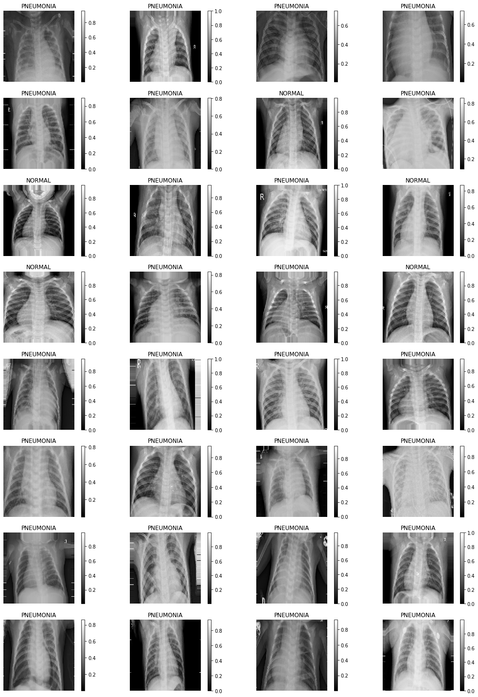
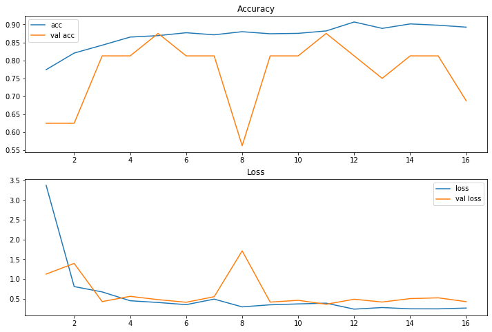
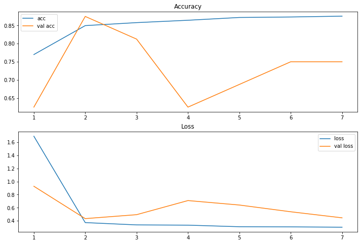
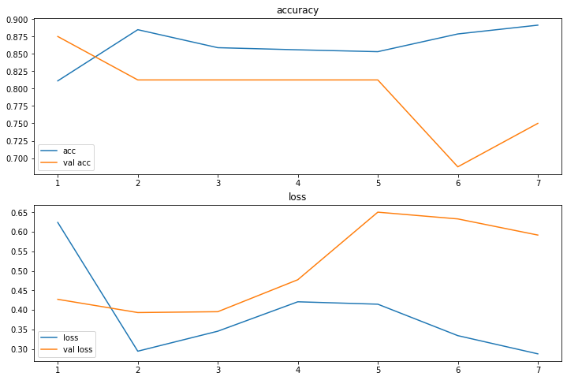
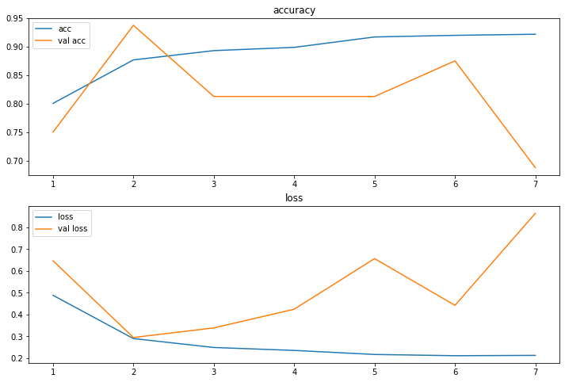
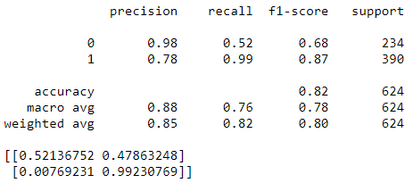

# Phase 4 Project - Image Classification

Carl Cook
081720-ONL-DS-PT

## Introduction

For this project, we will be using neural networks with Keras to examine X-ray
images of lungs. The neural networks will attempt to identify whether or not 
the patient in question has pneumonia.

We will be trying several neural network structures to see which can provide
the best predictions. Since this is a medical problem, we want models that can
provide high recall on positive cases. After all, when identifying diseases,
false positives are preferable to false negatives.

Let's get into the OSEMN process.

## Obtain

This data was obtained from the [Chest X-Ray Images (Pneumonia)](https://www.kaggle.com/paultimothymooney/chest-xray-pneumonia)
dataset on Kaggle.

## Scrub

We used the ImageDataGenerator from Keras to organize and resize the data for
use in our models.

'''
{

    from tensorflow.keras.preprocessing.image import ImageDataGenerator

    train_data = ImageDataGenerator(rescale=1/255,
                                    shear_range=0.2,
                                    zoom_range=0.2
                                    horizontal_flip=True)
    val_data = ImageDataGenerator(rescale=1/255)
    test_data = ImageDataGenerator(rescale=(1/255)

    train_generator = train_data.flow_from_directory('./data/train',
                                                     color_mode='rgb',
                                                     target_size=(224,224),
                                                     batch_size=32,
                                                     class_mode='binary')
    val_generator = val_data.flow_from_directory('./data/val',
                                                 color_mode='rgb',
                                                 target_size=(224,224),
                                                 batch_size=16,
                                                 shuffle=False,
                                                 class_model='binary')
    test_generator = test_data.flow_from_directory('./data/test',
                                                   color_mode='rgb',
                                                   target_size=(224,224),
                                                   batch_size=32,
                                                   shuffle=False,
                                                   class_mode='binary')
                                                   
}
'''

With this, we can pass image data to our models as batches of (224,224,3) arrays.

## Examine

Let's take a look at one batch of train data.

With a quick look at the images, we can determine that maybe positive cases
show a little more fuzzy grayness between the ribs, but it's certainly not
anything I would be comfortable trying to identify on my own.

Let's get on to the models, then!

## Model

As mentioned earlier, we're using Keras to build our neural networks, so we'll
need to make a few imports to have the necessary tools.

'''
{

    from tensorflow.keras.models import *
    from tensorflow.keras.layers import *
    from tensorflow.keras.callbacks import ModelCheckpoint, EarlyStopping

    from sklearn.metrics import confusion_matrix, classification_report
    
}
'''

These models can be time-intensive, so it's in our best interest to use the
callbacks. These will stop our training early when the model stops improving
and will also save the weights from the model with the best loss metric on the
validation set.

'''
{

    def init_callbacks():
        early_stopping = EarlyStopping(monitor='val_loss', patience=5)
        model_checkpoint = ModelCheckpoint('best_model.h5', monitor='val_loss',
                                           verbose=1, save_best_only=True,
                                           save_weights_only=True)
        callbacks = [early stopping, model_checkpoint]
        return callbacks
        
}
'''

Our first model is shallow: one hidden dense layer with 128 nodes.

'''
{

    model_1 = Sequential()
    model_1.add(Flatten(input_shape=(224,224,3)))
    model_1.add(Dense(128, activation='relu'))
    model_1.add(Dense(1, activation='sigmoid'))

    model_1.compile(loss='binary_crossentropy',
                   optimizer='adam',
                   metrics=['accuracy'])
    model_1.summary()
    
}
'''

Our first model is promising, with 86% accuracy and 91% positive recall.

Let's add a little depth to the model and see if we can improve these scores

'''
{

    model_2 = Sequential()
    model_2.add(Flatten(input_shape=(224,224,3)))
    model_2.add(Dense(64, activation='relu'))
    model_2.add(Dense(64, activation='relu'))
    model_2.add(Dense(64, activation='relu'))
    model_2.add(Dense(1, activation='sigmoid'))

    model_2.compile(loss='binary_crossentropy',
                    optimizer='adam',
                    metrics=['accuracy'])
    model_2.summary()
    
}
'''

The added depth didn't help, reducing our accuracy to 84% and our positive
recall to 90%

Now we'll try a simple CNN.

'''
{

    model_3 = Sequential()
    model_3.add(Conv2D(128, kernel_size=3, activation='relu',
                       input_shape=(224,224,3)))
    model_3.add(Conv2D(64, kernel_size=3, activation='relu'))
    model_3.add(Conv2D(32, kernel_size=3, activation='relu'))
    model_3.add(Flatten())
    model_3.add(Dense(1, activation='sigmoid'))

    model_3.compile(loss='binary_crossentropy',
                  optimizer='adam',
                  metrics=['accuracy'])
    model_3.summary()
    
}
'''

This dropped our accurcy further to 78%, but it might be worth it as
positive recall improved to 97%.

Let's add a little more complexity to our CNN and see if we can improve our
results further.

'''
{

    model_4 = Sequential()
    model_4.add(Conv2D(32, kernel_size=(3,3), activation='relu',
                       input_shape=(224,224,3)))
    model_4.add(Conv2D(64, kernel_size=(3,3), activation='relu'))
    model_4.add(MaxPooling2D(pool_size=(2,2)))
    model_4.add(Dropout(0.25))
    model_4.add(Conv2D(128, kernel_size=(3,3), activation='relu'))
    model_4.add(MaxPooling2D())
    model_4.add(Dropout(0.25))
    model_4.add(Flatten())
    model_4.add(Dense(64, activation='relu'))
    model_4.add(Dropout(0.5))
    model_4.add(Dense(1, activation='sigmoid'))

    model_4.compile(loss='binary_crossentropy',
                  optimizer='adam',
                  metrics=['accuracy'])

    model_4.summary()
    
}
'''

That's more like it! Accuracy improved to 82%, and while that's less than our
first two models, our positive recall is at 99%. And our negative precision is
at 98%. This model, then, finds 99% of positive cases, and if it predicts
negative, you can be 98% sure of the result. This seems acceptable.

## Interpret

While adding convolutional layers to the model seemed to decrease accuracy,
it certainly improved recall. There are definitely some false positives in the
test set, but false negatives have been almost entirely negated. I think this
is an acceptable compromise given the problem at hand.

## Recommendations

